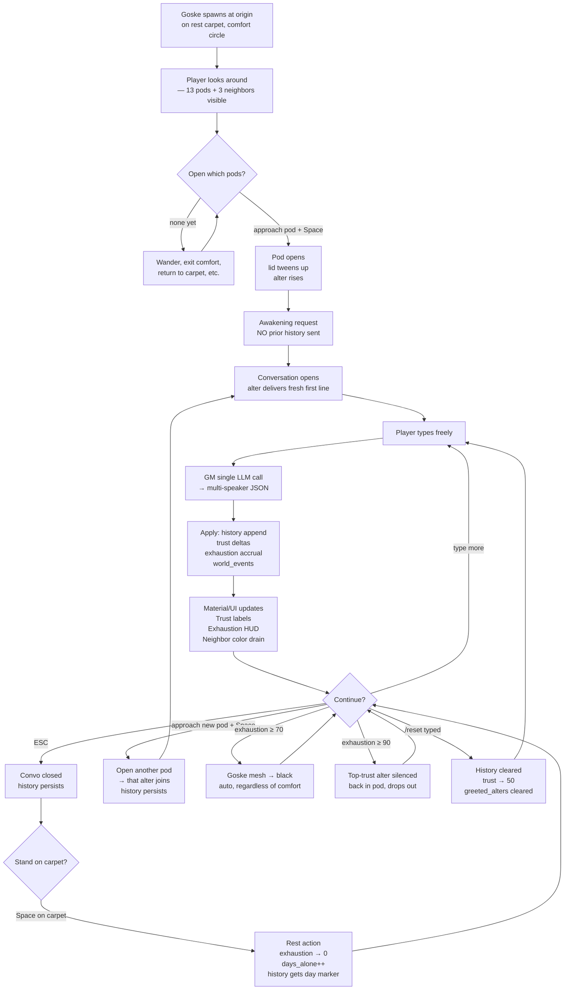

# Player journey — current vertical slice

> What a single run looks like, end-to-end. Lives next to the GDD; this is the flow, that's the shape.

## State / event flow

## Pressure axes

Two opposite costs press on the player:

- **Social presence cost** → exhaustion goes up, room dims, alters silence themselves.
- **Isolation cost** → days_alone goes up, alters drift, neighbors fade further.

Neither side is "the safe one". Optimal play is calibrated tension.

## Hidden axes the GM sees

Every turn the GM gets:

- `trust` per alter
- `exhaustion`
- `unlocked_alters`, `silenced_alters`
- `comfort_exits` (how often Goske left the yellow circle)
- `play_seconds`
- `npc_intensity` per neighbor
- `days_alone`

Plus the canon facts (13 pods, 3 functional, 10 sealed, 3 neighbors) and the mystery thread block. The GM uses these to pace the dialog, decide who speaks, and emit world events.

## Out-of-band escape hatches

- `/reset` — wipes history, trust, greeted_alters. Sole purpose: rescue stuck-in-safety-loop runs (when the LLM has anchored on a refusal and won't move). Not a player-facing mechanic; the player can use it but it's primarily a dev tool.
- `ESC` — closes panel without losing state. Resume by approaching any unlocked alter or its pod.

## What the slice does NOT cover (yet)

- Endings (planned Iter 4, RGB Voronoi)
- Multiple physical contexts (home / work / metro)
- NPC dialogue (intentionally absent — see ADR-004)
- Combat / skill check encounters
- Save/load
